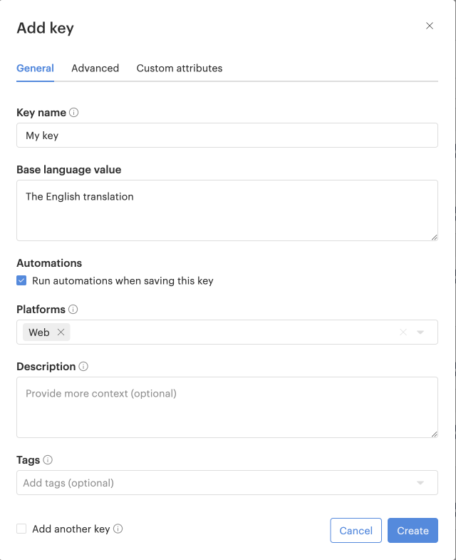
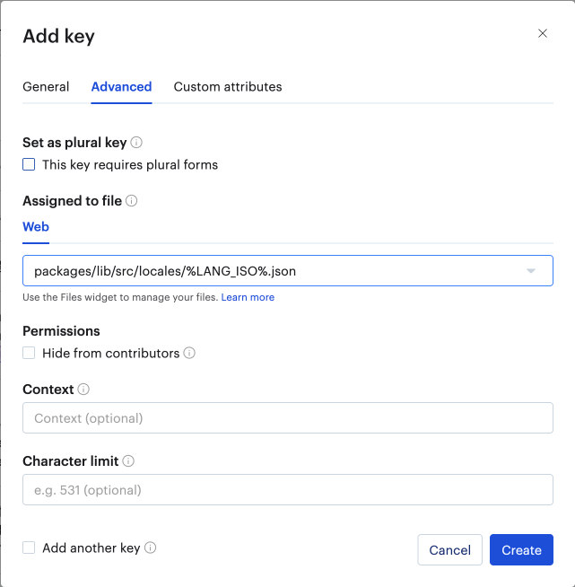

# README #

A Qumu Widget library that provides the following widgets:

- **PresentationWidget**

## How to use the Widget ##

```typescript
  <div id="widget-container"></div>

  <link rel="stylesheet" type="text/css" href="./your-assets-path/presentation-widget.css" />

  <script type="module">
    import { PresentationWidget } from '@enghouse-qumu/widget/presentation-widget.js';

    const presentationWidget = await PresentationWidget.create({
      // CSS selector for the container element where the widget will be rendered
      selector: '#widget-container',

      // Qumu instance host name
      host: 'my-instance.qumu.com',

      // The presentation GUID to load. Can be a smart search or a single presentation
      guid: 'AaBbCcDd123456',

      widgetOptions: {
        // Check the docs for available options
      },

      playerParameters: {
        // Check the docs for available options
      }
    });
  </script>
```

## Add translations to the apps

We support internationalisation at both the client and server level via Lokalise. To add a new translation to the app, you need to follow those steps:

The first step is to add a new key in Lokalise.

Make sure you fill the General tab as such:

* Key name: Your new key
* Base language value: The English translations
* Keep `Run automations when saving this key` checked
* Platforms: Web

The other fields are optional.



Make sure you fill the Advanced tab as such:

* Assigned to file: Use the proper value based on where you want this translation to go: `packages/lib/src/locales/%LANG_ISO%.json`
  

You can now click on the "Create" button. The translations should automatically be added for the other languages too thanks to the automation.

The second step is to run `cd tools/lokalise && npm run start` from the root folder. This will bring the translations from Lokalise into the project.
